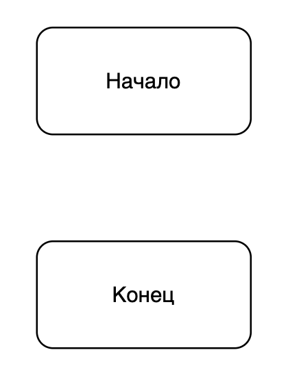
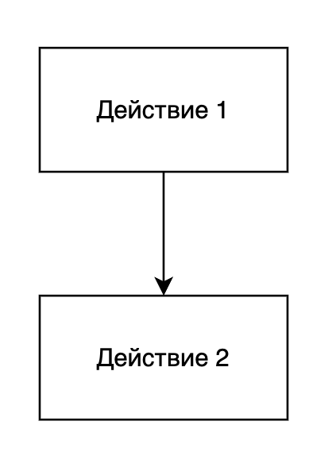
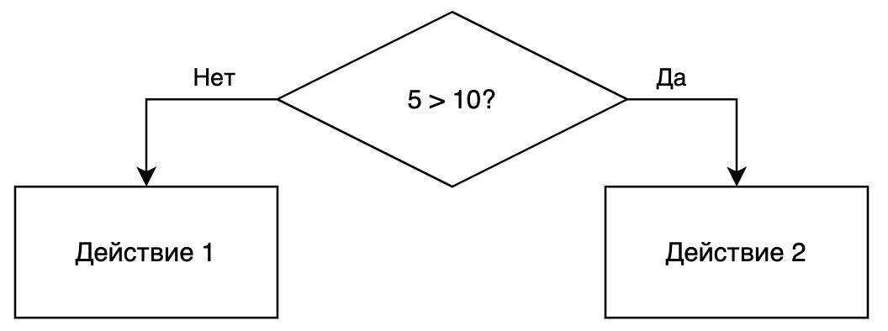
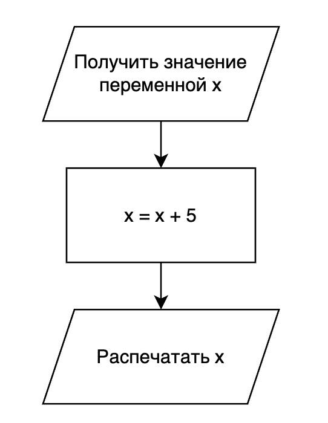

Блок-схема - это диаграмма, которая показывает последовательность действи в алгоритме. В этом документе показываются основные типы блоков и что они значат.

#### Начало и конец

#### Действие

#### Условие

#### Операции ввода-вывода

