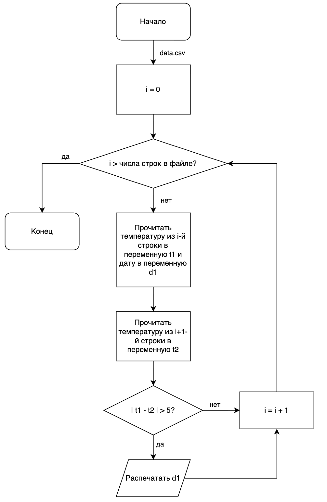

Это третий - предпоследний - блок задач по программированию на межшколу. В отличие от предыдущих (и следующего) блоков, тут не нужно будет писать код - мы будем заниматься верхнеуровневым дизайном наших программ.

Когда говорят про дизайн программного обеспечения, имеют ввиду недетализированное описание кода - его компонент, последовательности действий в алгоритме и данных, которые будут использоваться кодом. Для такого описания чаще всего используются схемы или диаграммы. Один из таких средств для рисования диаграмм мы разберём ниже, но, для интересующихся, есть [Mermaid](https://mermaid.js.org/), [C4](https://c4model.com/), [draw.io](https://app.diagrams.net/), [Escalidraw](https://excalidraw.com/) и множество других.

Разберём на примере: представьте, что нам нужно написать код, который будет оценивать тренды в прогнозе погоды на ближайшие дни и предупреждать пользователей о резких изменениях температуры. Процесс решения состоит из нескольких шагов:
1. Уточнение требований
	- В каком формате будут данные о температуре?
	- Что такое "резкое изменение"?
	- Как именно нужно предупреждать пользователей?
2. Дизайн решения
	- Как читать файл?
	- Как сделать эффективный алгоритм подсчёта резкости изменений?
3. Написание кода
4. Тестирование

Пунктами 3 и 4 мы уже занимались в двух предыдущих блоках, в этом мы будем заниматься пунктом 2 - *зная требования, как именно лучше всего структурировать решение?*. 

Возвращаясь к задаче, давайте пропишем требования:
- В качестве входных данных используется файл `data.csv`, в котором построчно пишется день наблюдения (текстовый столбец `date`) и средняя температура в этот день (число с плавающей точкой, столбец `temp`) по шкале Цельсия. Даты идут подряд без пропусков в порядке возрастания.
- Резкое изменение определяется как изменение между двумя последовательными днями более, чем на 5 градусов по шкале Цельсия.
- Предупреждение осуществляется печатью сообщения с датой в терминал.

Зная это всё, нам нужно придумать, как именно реализовать решение. Рассуждения и картинки, которые пойдут дальше - это то, что вам нужно будет сделать в задачах.

Сначала опишем, как будет выглядеть алгоритм верхнеуровнево (то есть, широкими мазками):
1. Получить список температур в каждый день, прочитав файл
2. Для каждой даты сравнить температуру с соседним днём и вычислить разницу
3. Если разница больше 5 градусов, распечатать дату в терминал

Имея такой алгоритм, теперь можем более подробно по шагам описать низкоуровневое решение (то есть, конкретные шаги). Проще всего это сделать блок-схемой:

Такая блок-схема уже сильно больше похожа на код, который будет написан в редакторе в итоге - в этом и смысл их рисования. Если сначала нарисовать блок-схему, то на этапе написания кода можно будет отключить мозг и просто преобразовывать квадратики в код на Python.

В заданиях этого блока от вас нужна будет такая картинка - как её удобно нарисовать, можно прочитать по ссылкам в конце этого текста.
### FAQ

#### А это правда полезное упражнение? Зачем рисовать квадратики, если можно сразу писать код?
Да! Смысл такого архитектурного дизайна в том, чтобы разделить решение (любой) задачи на написание кода на два этапа - первый этап, в котором подробно продумывается решение, и второй, где программист как обезьянка набирает код на клавиатуре, отключив мозг. Или, что более реалистично в 2026 году - скармливает такой дизайн-документ или диаграмму в дипсик и просит его написать код.

Так как с написанием самого кода искусственный интеллект справляется не особо хуже среднего программиста, важным навыком становится умение описать ИИ, что именно хочется сделать. Дизайн-документ и диаграммы - это наиболее эффективный способ задать промпт для ChatGPT или любого другого чат-бота.
#### А это правда полезное упражнение? Кому будет полезно что-то печатать в терминал?
Да! 

Конечно, печать в терминал сама по себе не особо сейчас используется для написания систем оповещения и в основном нужна для простых скриптов, где реальный интерфейс не нужен. Тем не менее, представьте, что вместо печати в терминал мы хотим написать телеграм-бота, который будет оповещать о резких изменениях температуры. Всё, что в нашей программе поменяется - это самый нижний блок. Вместо вызова функции `print(message)` там будет вызов какой-нибудь функции вида `send_to_telegram(message)`. Весь остальной код будет работать так же.

#### Как рисовать такие диграммы?
Строго говоря, как угодно - при большом желании это можно делать ручкой на бумаге или в Paint.

Тем не менее, удобнее всего пользоваться инструментами специально для этого. Один из таких - draw.io. Описание того, как им пользоваться (с картинками), [тут](draw_io.md).

#### Как загружать?

В каждом задании будет поле для прикрепления файла. Можно прикреплять в любом удобном формате картинок, но лучше всего - PDF или JPEG.

#### А что такое блок-схема?
Это способ описания того, как будет работать код, при помощи диаграмм. У них есть специальная нотация, про которую можно почитать [тут](block_diagram.md).

#### Как будут оцениваться задания?
Несколько равнозначных критериев:
- **Корректность диаграммы**: правильность обозначений на диаграмме - все блоки обозначены нужными фигурами, есть все нужные стрелки
- **Корректность алгоритма**: учтены все краевые случаи, не забыты блоки, порядок исполнения корректный
- **Читаемость диаграммы**: насколько сама блок-схема использует понятные обозначения, вводит переменные

Сама оценка будет после окончания модуля, в этом главное отличие от предыдущих модулей - у вас будет сколько угодно возможностей загрузить свою картинку, но оценена будет только последняя картинка после завершения модуля.
