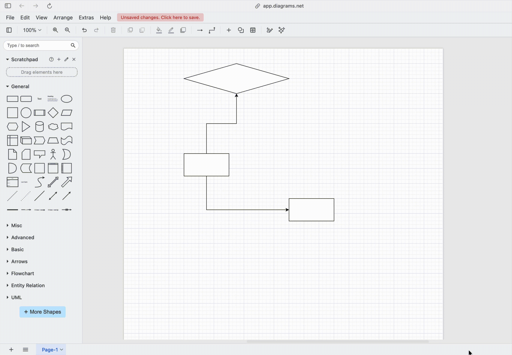

https://draw.io (он же https://app.diagrams.net/) - простой ресурс для того, чтобы рисовать блок-схемы (и любые другие диаграммы произвольной сложности). Весь интерфейс сводится к передвиганию блоков из одного места в другое, соединению блоков между собой и добавлению текста на блоки и связи. Для конкретных действий см. видео ниже.

#### Создание нового блока

#### Соединение блоков между собой

#### Модификация связей между блоками

#### Добавление текста на блок или связь

Нужно сделать двойной клик левой кнопкой мыши на том объекте, на котором хочется текст.

#### Игра со стилями

#### Сохранение картинки диаграммы

#### Сохранение самой диаграммы (чтобы потом отредактировать)

