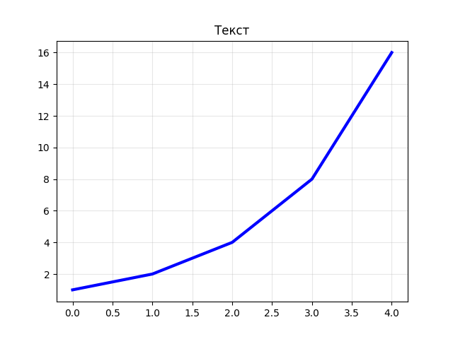
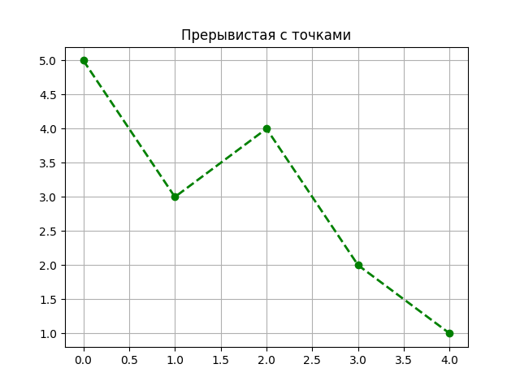
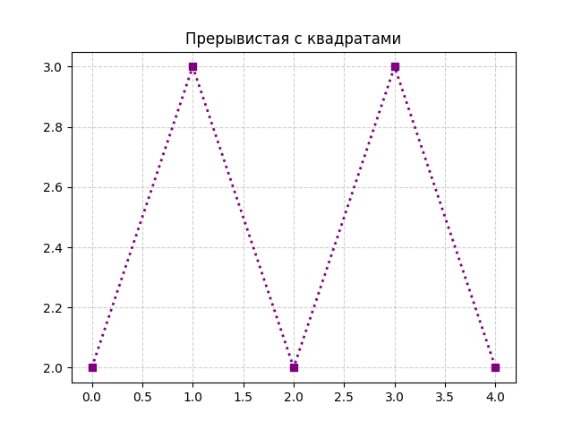
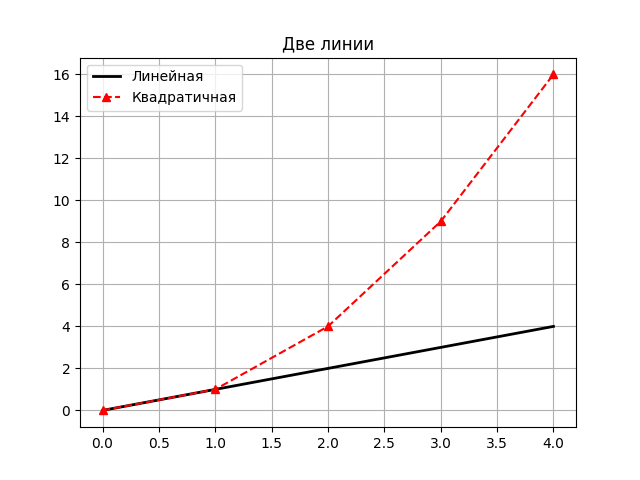
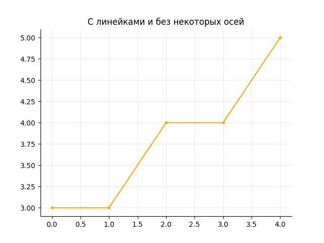

Последний блок!

В конце школы мы строили некоторое количество графиков - в этом наборе заданий вам предстоит заниматься именно этим. Большинство заданий будет состоять в том, чтобы, по выданному вам файлу или словестному описанию данных построить график. В качестве ответа нужно будет предоставить только сам график в виде картинки. Загружать код, как и в прошлом блоке, не нужно.

Критериев, по которым будут оцениваться графики, несколько (все равнозначные):
1. Правильность решения - насколько график соответствует тому, что просилось в задании.
2. Читаемость графика - насколько по графику понятно, что было построено.
3. Оригинальность графика - насколько выбор цветов, линий и общего вида графика является осознанным и отражает индивидуальные решения автора.

Дедлайн совпадает с окончанием межшколы - **15 февраля**.

Ниже будет набор примеров, показывающих, как можно построить разные графики при помощи matplotlib.

### Раз

```python
import matplotlib.pyplot as plt

x = [0, 1, 2, 3, 4]
y = [1, 2, 4, 8, 16]

plt.plot(x, y, color="blue", linewidth=3)
plt.grid(True, alpha=0.3)
plt.title("Thick solid line")
plt.show()
```



### Два

```python
import matplotlib.pyplot as plt

x = [0, 1, 2, 3, 4]
y = [5, 3, 4, 2, 1]

plt.plot(x, y, linestyle="--", marker="o", color="green", linewidth=2)
plt.grid(True)
plt.title("Прерывистая с точками")
plt.show()
```



### Три

```python
import matplotlib.pyplot as plt

x = [0, 1, 2, 3, 4]
y = [2, 3, 2, 3, 2]

plt.plot(x, y, linestyle=":", marker="s", color="purple", linewidth=2)
plt.grid(True, linestyle="--", alpha=0.6)
plt.title("Прерывистая с квадратами")
plt.show()
```



### Четыре

```python
import matplotlib.pyplot as plt

x = [0, 1, 2, 3, 4]
y1 = [0, 1, 2, 3, 4]
y2 = [0, 1, 4, 9, 16]

plt.plot(x, y1, linestyle="-", color="black", linewidth=2, label="Линейная")
plt.plot(x, y2, linestyle="--", color="red", marker="^", label="Квадратичная")

plt.grid(True)
plt.legend()
plt.title("Две линии")
plt.show()
```



### Пять

```python
import matplotlib.pyplot as plt

x = [0, 1, 2, 3, 4]
y = [3, 3, 4, 4, 5]

plt.plot(x, y, marker=".", linestyle="-", color="orange")

ax = plt.gca()
ax.spines["top"].set_visible(False)
ax.spines["right"].set_visible(False)

plt.grid(True, linewidth=0.5, alpha=0.4)
plt.title("С линейками и без некоторых осей")
plt.show()
```


